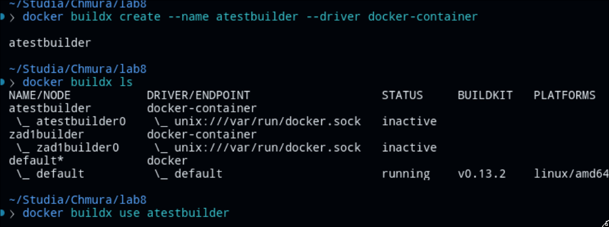
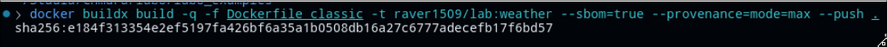
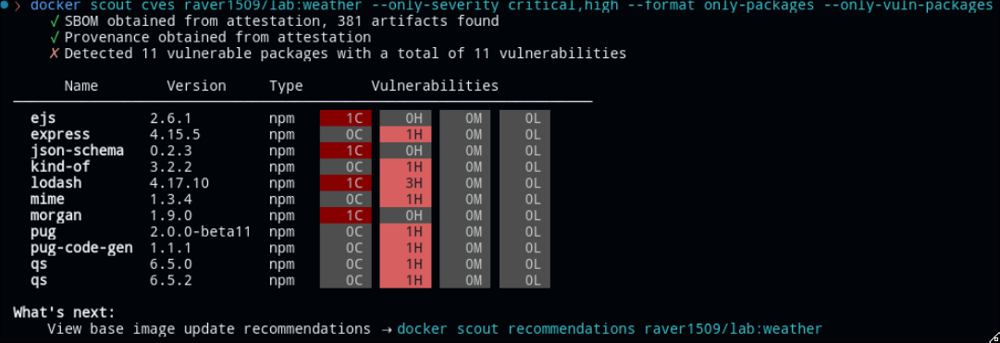
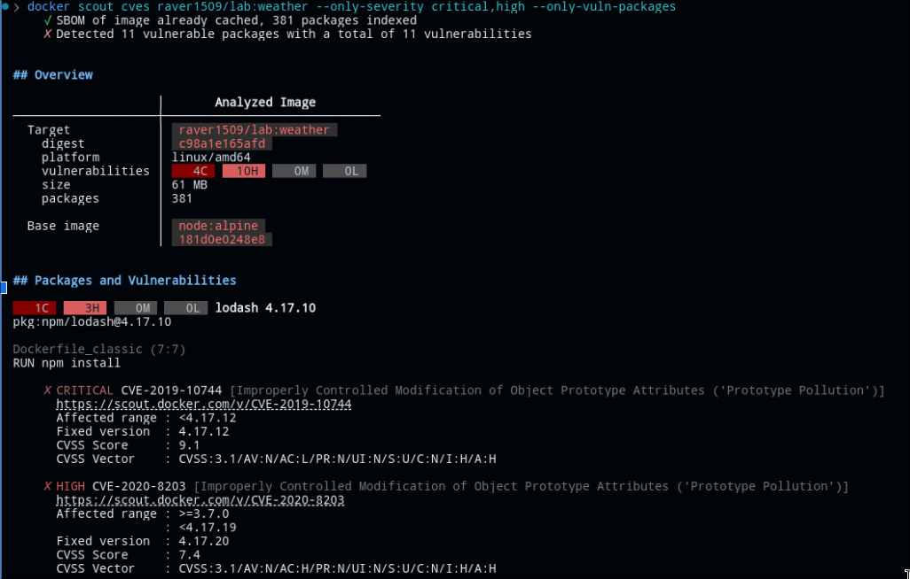
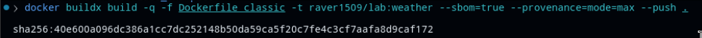
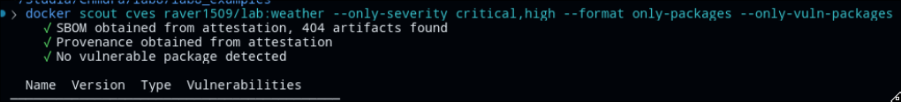

1. Stworzenie buildera


2. Zbudowanie obrazu


3. Sprawdzenie podatności na zagrożenia klasyifkowane jako critical lub hight za pomocą docker scout


4. Uzyskanie dokładniejszych informacji o zagrożonych wersjach 


5. Zmiana zawartości plicku package.json
```
{
  "name": "weather",
  "version": "0.0.0",
  "private": true,
  "scripts": {
    "start": "node ./bin/www"
  },
  "dependencies": {
    "body-parser": "^1.18.3",
    "cookie-parser": "~1.4.3",
    "debug": "~2.6.9",
    "ejs": "^3.1.7",
    "express": "^4.17.3",
    "morgan": "^1.9.1",
    "pug": "^3.0.1",
    "request": "^2.88.0",
    "serve-favicon": "~2.4.5",
    "lodash": "^4.17.21",
    "json-schema": "^0.4.0",
    "jsprim": "^2.0.2",
    "qs": "^6.5.3",
    "mime": "^1.4.1",
    "kind-of": "^6.0.3",
    "pug-code-gen": "^2.0.3"
  }
}
```

6. Ponowne zbudowanie obrazu 


7. Sprawdzenie istnienia podatności na zagrożenia


Link do repozytorium Dockerhub:
https://hub.docker.com/layers/raver1509/lab/weather/images/sha256-d841bfedc711da8f9c9022caa8572b9c166b31800fab3ec81fd7df929f3d7cc2?context=repo
